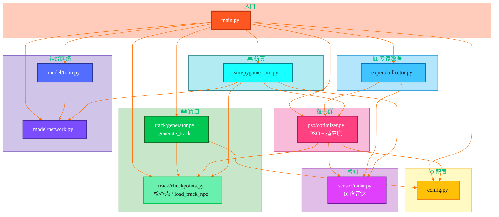

# 01 - 模块依赖（鲜艳配色）

```mermaid
%%{init: {
  "theme": "base",
  "themeVariables": {
    "primaryColor": "#7C4DFF",
    "primaryTextColor": "#FFFFFF",
    "primaryBorderColor": "#5E35B1",
    "lineColor": "#FF6D00",
    "secondaryColor": "#00E5FF",
    "tertiaryColor": "#FF4081",
    "fontFamily": "system-ui, sans-serif"
  }
}}%%
flowchart TB
    subgraph ENTRY["🚀 入口"]
        M["main.py"]
    end
    subgraph CFG_S["⚙️ 配置"]
        CFG["config.py"]
    end
    subgraph TRACK_S["🛤️ 赛道"]
        TG["track/generator.py<br/>generate_track"]
        TC["track/checkpoints.py<br/>检查点 / load_track_npz"]
    end
    subgraph SENSOR_S["📡 感知"]
        RD["sensor/radar.py<br/>16 向雷达"]
    end
    subgraph PSO_S["🐝 粒子群"]
        PO["pso/optimizer.py<br/>PSO + 适应度"]
    end
    subgraph EXPERT_S["📊 专家数据"]
        EX["expert/collector.py"]
    end
    subgraph MODEL_S["🧠 神经网络"]
        NW["model/network.py"]
        TR["model/train.py"]
    end
    subgraph SIM_S["🎮 仿真"]
        SM["sim/pygame_sim.py"]
    end

    M --> CFG
    M --> TG
    M --> TC
    M --> PO
    M --> EX
    M --> NW
    M --> TR
    M --> SM
    TG --> CFG
    TG --> TC
    PO --> CFG
    PO --> RD
    PO --> TC
    EX --> RD
    EX --> PO
    TR --> NW
    SM --> RD
    SM --> TC
    SM --> PO
    SM --> NW

    style M fill:#FF5722,stroke:#BF360C,color:#fff,stroke-width:3px
    style CFG fill:#FFC107,stroke:#F57F17,color:#1a1a1a,stroke-width:2px
    style TG fill:#00C853,stroke:#1B5E20,color:#fff,stroke-width:2px
    style TC fill:#69F0AE,stroke:#00C853,color:#1a1a1a,stroke-width:2px
    style RD fill:#E040FB,stroke:#6A1B9A,color:#fff,stroke-width:2px
    style PO fill:#FF4081,stroke:#AD1457,color:#fff,stroke-width:2px
    style EX fill:#40C4FF,stroke:#0277BD,color:#1a1a1a,stroke-width:2px
    style NW fill:#7C4DFF,stroke:#4527A0,color:#fff,stroke-width:2px
    style TR fill:#536DFE,stroke:#283593,color:#fff,stroke-width:2px
    style SM fill:#18FFFF,stroke:#00838F,color:#004D40,stroke-width:2px
    style ENTRY fill:#FFCCBC,stroke:#FF5722
    style CFG_S fill:#FFF9C4,stroke:#F9A825
    style TRACK_S fill:#C8E6C9,stroke:#2E7D32
    style SENSOR_S fill:#E1BEE7,stroke:#8E24AA
    style PSO_S fill:#F8BBD9,stroke:#C2185B
    style EXPERT_S fill:#B3E5FC,stroke:#0288D1
    style MODEL_S fill:#D1C4E9,stroke:#5E35B1
    style SIM_S fill:#B2EBF2,stroke:#006064
```
