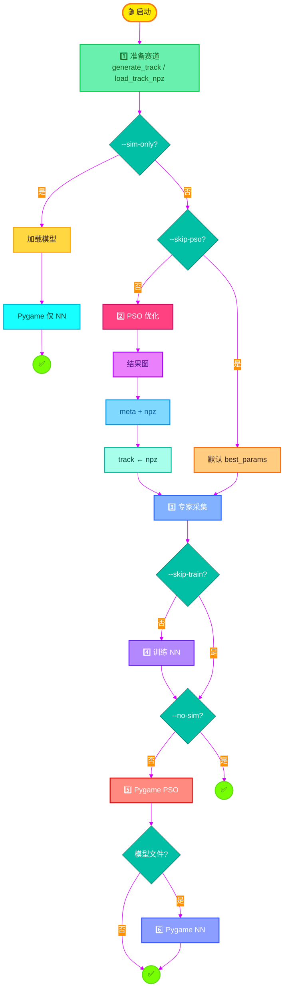

# 02 - main.py 主流程（鲜艳配色）

```mermaid
%%{init: {
  "theme": "base",
  "themeVariables": {
    "primaryColor": "#00BFA5",
    "primaryTextColor": "#FFFFFF",
    "lineColor": "#D500F9",
    "secondaryColor": "#FF9100",
    "tertiaryColor": "#2962FF"
  }
}}%%
flowchart TD
    START([🎬 启动]) --> A["1️⃣ 准备赛道<br/>generate_track / load_track_npz"]
    A --> B{--sim-only?}
    B -->|是| L[加载模型] --> NN["Pygame 仅 NN"] --> END1([✅])
    B -->|否| C{--skip-pso?}
    C -->|否| PSO["2️⃣ PSO 优化"] --> PLOT[结果图] --> SAVE[meta + npz] --> RELOAD[track ← npz]
    C -->|是| DEF[默认 best_params]
    RELOAD --> D
    DEF --> D["3️⃣ 专家采集"]
    D --> E{--skip-train?}
    E -->|否| T["4️⃣ 训练 NN"] --> F
    E -->|是| F{--no-sim?}
    F -->|否| S1["5️⃣ Pygame PSO"] --> S2{模型文件?}
    S2 -->|是| S3["6️⃣ Pygame NN"]
    S2 -->|否| END2([✅])
    S3 --> END2
    F -->|是| END3([✅])

    style START fill:#FFEA00,stroke:#F57F17,color:#3E2723,stroke-width:3px
    style A fill:#69F0AE,stroke:#00C853,color:#1B5E20,stroke-width:2px
    style PSO fill:#FF4081,stroke:#C51162,color:#fff,stroke-width:2px
    style PLOT fill:#EA80FC,stroke:#AA00FF,color:#4A148C,stroke-width:2px
    style SAVE fill:#80D8FF,stroke:#0091EA,color:#01579B,stroke-width:2px
    style RELOAD fill:#A7FFEB,stroke:#00BFA5,color:#004D40,stroke-width:2px
    style DEF fill:#FFCC80,stroke:#FF6D00,color:#3E2723,stroke-width:2px
    style D fill:#82B1FF,stroke:#2962FF,color:#fff,stroke-width:2px
    style T fill:#B388FF,stroke:#651FFF,color:#fff,stroke-width:2px
    style S1 fill:#FF8A80,stroke:#D50000,color:#fff,stroke-width:2px
    style S3 fill:#8C9EFF,stroke:#304FFE,color:#fff,stroke-width:2px
    style NN fill:#18FFFF,stroke:#00B8D4,color:#004D40,stroke-width:2px
    style L fill:#FFD740,stroke:#FFAB00,color:#3E2723,stroke-width:2px
    style END1 fill:#76FF03,stroke:#64DD17,color:#33691E,stroke-width:2px
    style END2 fill:#76FF03,stroke:#64DD17,color:#33691E,stroke-width:2px
    style END3 fill:#76FF03,stroke:#64DD17,color:#33691E,stroke-width:2px
```
