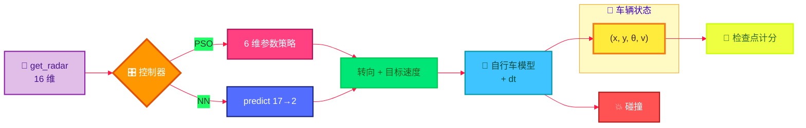

# 03 - 单步驾驶闭环（鲜艳配色）

```mermaid
%%{init: {
  "theme": "base",
  "themeVariables": {
    "lineColor": "#FF1744",
    "primaryColor": "#651FFF"
  }
}}%%
flowchart LR
    subgraph STATE["📍 车辆状态"]
        XY["(x, y, θ, v)"]
    end
    RD["📡 get_radar<br/>16 维"] --> CTRL{"🎛️ 控制器"}
    CTRL -->|PSO| P["6 维参数策略"]
    CTRL -->|NN| N["predict 17→2"]
    P --> U["转向 + 目标速度"]
    N --> U
    U --> KM["🚗 自行车模型<br/>+ dt"]
    KM --> XY
    XY --> CP["🏁 检查点计分"]
    KM --> COL["💥 碰撞"]

    style XY fill:#FFEB3B,stroke:#F57F17,color:#3E2723,stroke-width:3px
    style RD fill:#E1BEE7,stroke:#8E24AA,color:#4A148C,stroke-width:2px
    style CTRL fill:#FF9800,stroke:#E65100,color:#fff,stroke-width:3px
    style P fill:#FF4081,stroke:#AD1457,color:#fff,stroke-width:2px
    style N fill:#536DFE,stroke:#1A237E,color:#fff,stroke-width:2px
    style U fill:#00E676,stroke:#00C853,color:#1B5E20,stroke-width:2px
    style KM fill:#40C4FF,stroke:#0097A7,color:#004D40,stroke-width:2px
    style CP fill:#EEFF41,stroke:#C6FF00,color:#33691E,stroke-width:2px
    style COL fill:#FF5252,stroke:#B71C1C,color:#fff,stroke-width:2px
    style STATE fill:#FFF9C4,stroke:#F9A825
```
