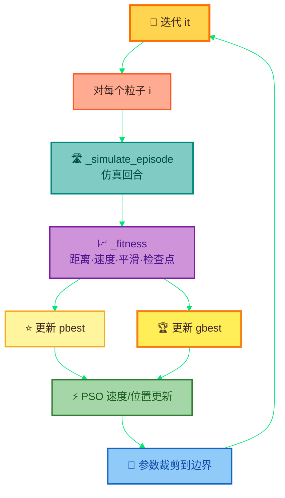

# 04 - PSO 迭代（鲜艳配色）

```mermaid
%%{init: {
  "theme": "base",
  "themeVariables": {
    "primaryColor": "#E91E63",
    "lineColor": "#00E676",
    "secondaryColor": "#FFEA00"
  }
}}%%
flowchart TD
    I["🔁 迭代 it"] --> LOOP["对每个粒子 i"]
    LOOP --> SIM["🛣️ _simulate_episode<br/>仿真回合"]
    SIM --> FIT["📈 _fitness<br/>距离·速度·平滑·检查点"]
    FIT --> PB["⭐ 更新 pbest"]
    FIT --> GB["🏆 更新 gbest"]
    PB --> VEL["⚡ PSO 速度/位置更新"]
    GB --> VEL
    VEL --> CLIP["📐 参数裁剪到边界"]
    CLIP --> I

    style I fill:#FFD54F,stroke:#FF6F00,color:#3E2723,stroke-width:3px
    style LOOP fill:#FFAB91,stroke:#FF5722,color:#3E2723,stroke-width:2px
    style SIM fill:#80CBC4,stroke:#00897B,color:#004D40,stroke-width:2px
    style FIT fill:#CE93D8,stroke:#7B1FA2,color:#4A148C,stroke-width:2px
    style PB fill:#FFF59D,stroke:#F9A825,color:#3E2723,stroke-width:2px
    style GB fill:#FFEE58,stroke:#F57F17,color:#3E2723,stroke-width:3px
    style VEL fill:#A5D6A7,stroke:#2E7D32,color:#1B5E20,stroke-width:2px
    style CLIP fill:#90CAF9,stroke:#1565C0,color:#0D47A1,stroke-width:2px
```
