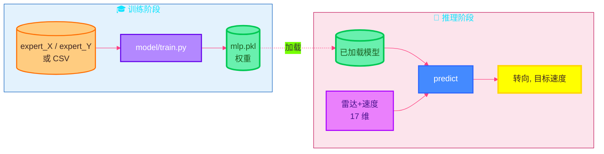

# 05 - 数据流：训练与推理（鲜艳配色）

```mermaid
%%{init: {
  "theme": "base",
  "themeVariables": {
    "primaryColor": "#00BCD4",
    "lineColor": "#FF4081",
    "secondaryColor": "#76FF03"
  }
}}%%
flowchart LR
    subgraph TRAIN["🎓 训练阶段"]
        NPZ[("expert_X / expert_Y<br/>或 CSV")]
        TR["model/train.py"]
        MDL[("mlp.pkl<br/>权重")]
        NPZ --> TR --> MDL
    end
    subgraph INFER["🔮 推理阶段"]
        MDL2[("已加载模型")]
        RD["雷达+速度<br/>17 维"]
        PR["predict"]
        OUT["转向, 目标速度"]
        MDL2 --> PR
        RD --> PR --> OUT
    end
    MDL -.->|加载| MDL2

    style NPZ fill:#FFCC80,stroke:#FF6D00,color:#3E2723,stroke-width:2px
    style TR fill:#B388FF,stroke:#6200EA,color:#fff,stroke-width:2px
    style MDL fill:#69F0AE,stroke:#00C853,color:#1B5E20,stroke-width:3px
    style MDL2 fill:#69F0AE,stroke:#00C853,color:#1B5E20,stroke-width:3px
    style RD fill:#EA80FC,stroke:#AA00FF,color:#4A148C,stroke-width:2px
    style PR fill:#448AFF,stroke:#2962FF,color:#fff,stroke-width:2px
    style OUT fill:#FFFF00,stroke:#FFD600,color:#3E2723,stroke-width:3px
    style TRAIN fill:#E3F2FD,stroke:#1565C0
    style INFER fill:#FCE4EC,stroke:#C2185B
```
